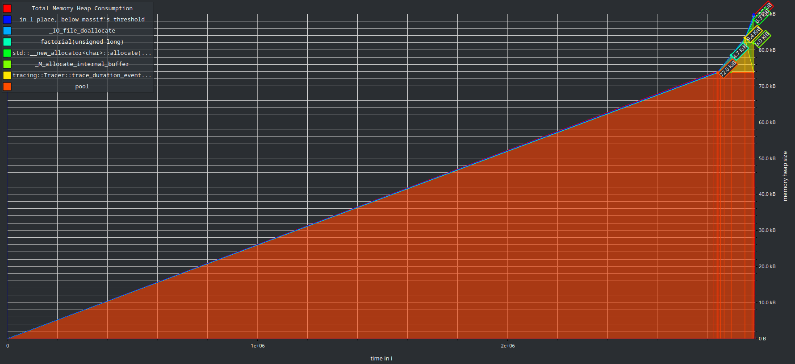
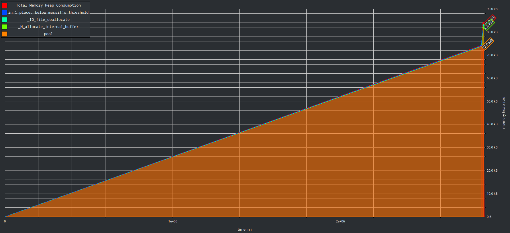
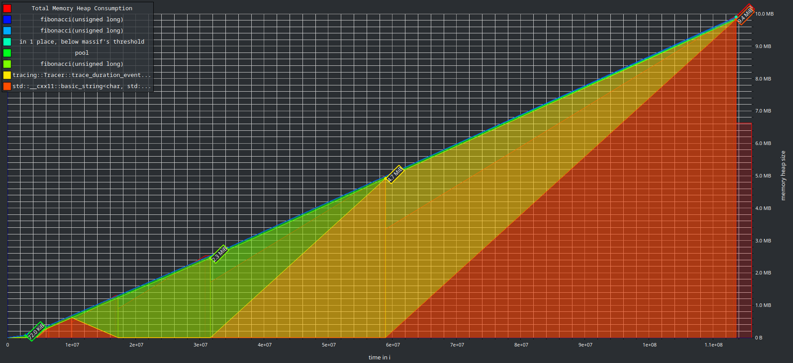

# tracing

## Factorial 1

```cpp
#include <iostream>

#include "tracing.hpp"

auto factorial(std::uint64_t n) -> std::uint64_t {
  if (n <= 1) {
    tracing::instant_event("factorial.base_case");
    return 1;
  }
  const tracing::DurationEvent event{"factorial.recursive_call"};
  return n * factorial(n - 1);
}

auto main() -> int {
  std::cout << factorial(20) << std::endl;
  tracing::Tracer::get_instance().dump("trace.json");
}
```



## Factorial 2

```cpp
#include <iostream>

#include "tracing.hpp"

auto factorial(std::uint64_t n) -> std::uint64_t {
  const tracing::DurationEvent event{"factorial"};
  std::uint64_t result = 1;
  for (std::uint64_t i = 2; i <= n; ++i) {
    result *= i;
  }
  return result;
}

auto main() -> int {
  std::cout << factorial(20) << std::endl;
  tracing::Tracer::get_instance().dump("trace.json");
}
```



## Fibonacci 1

```cpp
#include <iostream>

#include "tracing.hpp"

auto fibonacci(std::uint64_t n) -> std::uint64_t {
  if (n <= 1) {
    tracing::instant_event("fibonacci.base_case");
    return n;
  }
  const tracing::DurationEvent duration{"fibonacci.recursive_call"};
  return fibonacci(n - 1) + fibonacci(n - 2);
}

auto main() -> int {
  std::cout << fibonacci(20) << std::endl;
  tracing::Tracer::get_instance().dump("trace.json");
}
```



## Fibonacci 2

```cpp
#include <iostream>

#include "tracing.hpp"

auto fibonacci(std::uint64_t n) -> std::uint64_t {
  const tracing::DurationEvent event{"fibonacci"};
  if (n <= 1)
    return n;
  std::uint64_t a = 0;
  std::uint64_t b = 1;
  for (std::uint64_t i = 2; i <= n; ++i) {
    std::uint64_t c = a + b;
    a = b;
    b = c;
  }
  return b;
}

auto main() -> int {
  std::cout << fibonacci(20) << std::endl;
  tracing::Tracer::get_instance().dump("trace.json");
}
```


